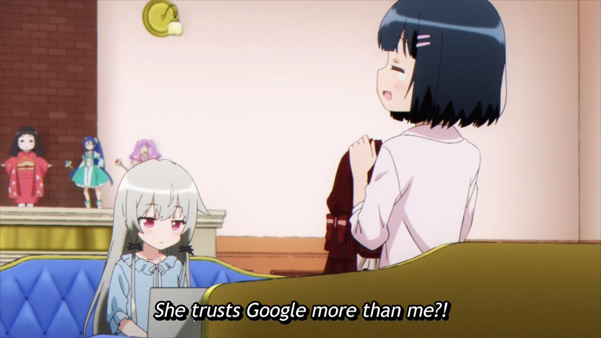
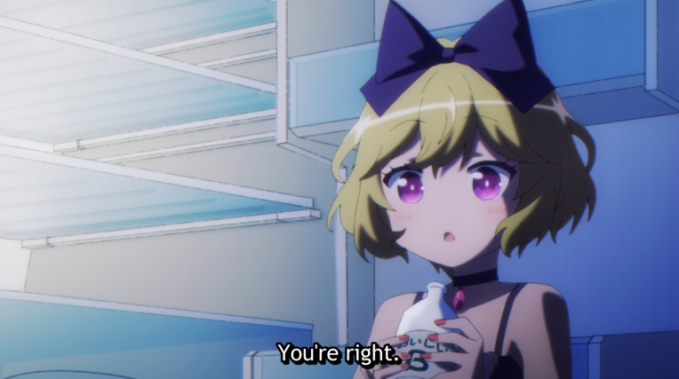

# Noob
[](https://github.com/anuraghazra/github-readme-stats)
[](https://github.com/anuraghazra/github-readme-stats)
<a href="https://github.com/DenverCoder1/github-readme-streak-stats">
    
</a>
*I am somehow able to only ~~be familiar with~~ know and use 1 programming to finish my master's degree*  
# LOL
How to trigger a C++ programmer
```cpp
#include <bits/stdc++.h>
using namespace std;
int main(void)
{
    cout << "Are you mad?" << endl;
    return 0;
}
```
# How to code


